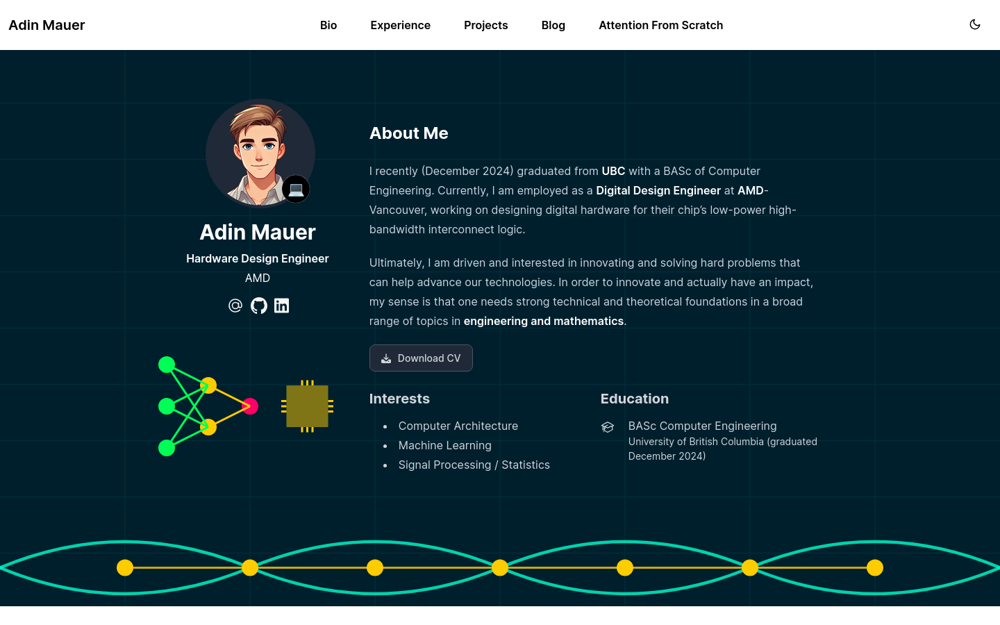

# Adin Mauer — Portfolio Website

Personal site built with Hugo (HugoBlox/Academic) and deployed via GitHub Pages.

- Live site: https://mauer4.github.io/
- Tech: Hugo Extended, HugoBlox blocks, GitHub Actions, GitHub Pages

## Overview

This repo powers my portfolio: bio, experience, projects, blog, publications, and an “Attention From Scratch” build log for a 12‑week Transformer inference project.

Key features:
- Automated import of Medium posts to the Blog
- Automated sync of selected GitHub repo READMEs into the Projects section
- One‑click deploy to GitHub Pages on push to `main`
- Data‑driven, interactive timeline for the “Attention From Scratch” page

## Structure

- `content/`
  - `_index.md` — homepage layout and sections
  - `authors/admin/_index.md` — profile data (bio, education, skills, awards)
  - `post/` — blog posts (including imported Medium posts)
  - `project/` — project pages (some auto‑generated from GitHub READMEs)
  - `attention-from-scratch/` — page rendering the 12‑week timeline
- `data/`
  - `attention_plan.yaml` — the timeline plan (weeks, status, comments)
  - `github_projects.yaml` — list of repos to sync into Projects
- `assets/`
  - `css/custom.css` — site custom styles, including the timeline
  - `js/attention.js` — interactions for the timeline component
- `layouts/shortcodes/attention_timeline.html` — renders the interactive timeline from `data/attention_plan.yaml`
- `static/` — static assets (icons, uploads)
- `config/_default/` — site config (menus, params, Hugo)
- `.github/workflows/` — CI for deploy, Medium import, and GitHub projects sync

## Automations

### 1) Medium → Blog

Workflow: `.github/workflows/medium-sync.yml`

What it does:
- Fetches your Medium RSS feed and converts each entry to a Hugo post under `content/post/<slug>/index.md`
- Adds `canonical_url` pointing to the original Medium article (SEO clean)
- Skips existing posts to remain idempotent

Setup:
- Repo Secret or Variable: `MEDIUM_FEED_URL` with your feed URL, e.g. `https://medium.com/feed/@YOUR_HANDLE` or `https://your-handle.medium.com/feed`
- Trigger via GitHub Actions → “Sync Medium Posts” → Run workflow

Script:
- `scripts/sync_medium.py` (uses `feedparser` + `requests`)

### 2) GitHub READMEs → Projects

Workflow: `.github/workflows/github-projects-sync.yml`

What it does:
- Reads `data/github_projects.yaml`
- For each repo, fetches repo metadata + README, rewrites relative links/images
- Writes/updates `content/project/<repo>/index.md`
- Use `featured: true` to show on the homepage “Selected Projects” grid

Setup:
- Configure repos in `data/github_projects.yaml`
- Trigger via GitHub Actions → “Sync GitHub Projects” → Run workflow

Script:
- `scripts/sync_github_projects.py` (uses `requests` + `pyyaml`)

### 3) Deploy to GitHub Pages

Workflow: `.github/workflows/publish.yaml`

What it does:
- Builds site with Hugo Extended and uploads the artifact
- Deploys to GitHub Pages using the latest actions (`configure-pages@v5`, `upload-pages-artifact@v3`, `deploy-pages@v4`)

Trigger:
- On push to `main` or manual run in Actions

## Attention From Scratch — Editing the Timeline

- Data file: `data/attention_plan.yaml`
  - Each `week` entry supports: `title`, `summary`, `details`, `target_date`, `completed`, `completed_date`, and `comments` (array of notes)
  - Set `completed: true` and `completed_date: YYYY-MM-DD` to mark done; header progress bar updates automatically
- Page: `content/attention-from-scratch/_index.md`
  - The page renders with ``
  - Icons appear next to titles (attention vs transformer) based on title text

## Local Development

Requirements:
- Hugo Extended (matching the CI version, currently `0.136.5`)

Commands:
- Build: `hugo --minify`
- Local server: `hugo server -D` then open `http://localhost:1313`

Note: keep Hugo/Go toolchains installed outside the repo. The repo ignores `tools/` and `*.zip` to avoid large binaries.

## Configuration & SEO

- Update site params: `config/_default/params.yaml` (SEO description, footer, analytics)
- Update menus: `config/_default/menus.yaml`
- Update base URL: `config/_default/hugo.yaml`

## Maintenance

- Large files: the repo ignores `tools/` and `*.zip`. History has been cleaned to remove previously committed large binaries.
- If you need to add big media, use Git LFS or host externally and link.

## License

See `LICENSE.md`.
