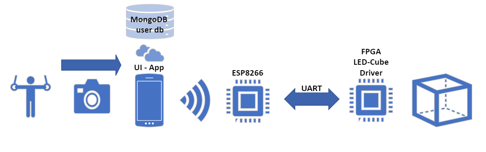
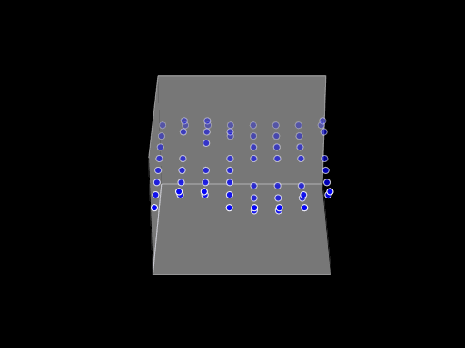

Video: https://www.youtube.com/watch?v=kbrSmiwQhu4

## Dance Cube

This project includes a 3D 8x8x8 LED cube connected and controlled via WiFi by an Android app. In addition to animated lighting, the phone camera runs an on-device ML model for pose estimation and projects the real-time movement of the person into the cube in 3D.

<!--more-->

## Components
- UI: Android application used to control the cube.
- ESP8266: WiFi connection from the Android app to the FPGA cube driver.
- FPGA-based LED cube driver.
- LED cube hardware (custom PCB).

## Features
- Turn all lights on or off.
- Loop through all 7 animations (30 seconds per animation).
- Choose a specific animation to stay on.
- Track per-user animation selections and popularity.
- Use the phone camera for real-time pose estimation and projection into the cube.

## How to use
FPGA component:
1. Create a Quartus project named `LED_Cube_Controller`.
2. Add all files in the `RTL` directory to the project.
3. Open `Cube_controller.qsys` and generate RTL, then add `Cube_controller/synthesis/Cube_controller.qip`.
4. Compile and download the design to the FPGA.
5. Hook up all `GPIO_0` to the GPIO extension board (ribbon recommended).

ESP8266:
1. Flash NodeMCU firmware to the ESP8266.
2. Copy the `.lua` script from the `lua` directory and add your phone hotspot credentials.

Android application:
1. Build the app in Android Studio and install it on the phone.
